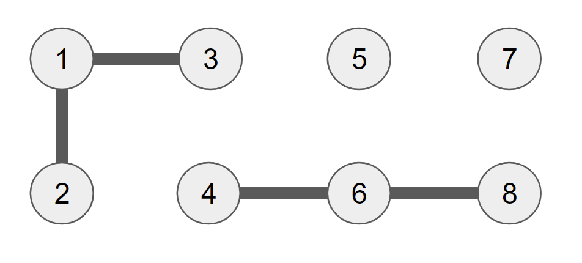
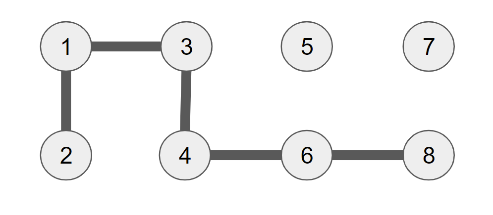

# Algorithms

This wiki presents a series of algorithms and their implementation.

## Union Find

This set of algorithms attempts to answer the following question:

- Given a set of points and a set of connections between those points, is point x connected to point y?
- That is to say, is there a path connecting x and y?

For a given set of objects, we postulate that we require:

- union(x, y): connects two components
- connected(x, y): is x connected to y

Assumptions:

- Reflexive: a point p is connected to itself
- Symmetric: if p is connected to q, then q is connected to p
- Transitive: if p is connected to q, and q is connected to r, then p is connected to r

Example:


Given the above example, we can introduce the concept of "connected components".

Efficient algorithms will make use of this and store this information.

|      | |1|2|3|
|------|-|-|-|-|

|      | |4|6|8|
|------|-|-|-|-|

|      | |5|
|------|-|-|

|      | |7|
|------|-|-|

The union command will modify the graph of connected components.
In fact, running union(3, 4) is equivalent to creating a connection between 3 and 4:



Now the connected components are:

|      | |1|2|3|4|6|8|
|------|-|-|-|-|-|-|-|

|      | |5|
|------|-|-|

|      | |7|
|------|-|-|

### Quick Find

The quick-find algorithm uses an array to store and retrieve connected components.

#### Description

We initialize an array, with values equal to the index.

|      |0|1|2|3|4|5|6|7|8|9|
|------|-|-|-|-|-|-|-|-|-|-|
|array |0|1|2|3|4|5|6|7|8|9|

When we connect the components, we make the values of the two components equal. If two indices have the same value, they are connected.

For example, union(3, 5):

|      |0|1|2|3|4|5|6|7|8|9|
|------|-|-|-|-|-|-|-|-|-|-|
|array |0|1|2|3|4|3|6|7|8|9|

union(2, 3):

|      |0|1|2|3|4|5|6|7|8|9|
|------|-|-|-|-|-|-|-|-|-|-|
|array |0|1|2|2|4|2|6|7|8|9|

#### Implementation

```java

public class QuickFind {

    private int[] id;

    public QuickFind(int N) {
        id = new int[N];

        for (int i = 0; i < N; i++) {
            id[i] = i;
        }
    }

    public boolean connected(int p, int q) {
        return id[p] == id[q];
    }

    /*
    ** This method loops the array and assigns value of qid
    ** to pid and all the previously connected components
    ** of pid.
    **/
    public void union(int p, int q) {

        int pid = id[p];
        int qid = id[q];

        for (int i = 0; i < id.length; i++) {
            if (id[i] == pid) id[i] = qid;
        }
    }
}

```

#### Comments

The problem of the quick find algorithm is that both in the initialization and the union, it needs to access the entire array.

This algorithm takes quadratic time. We can almost never accept this runtime because it does not scale in the way we want.

### Quick Union

#### Description

Quick union uses an array to store connected components. However, these are now viewed as trees and roots.

If p is connected to q, we say that q is the root of p. In the array, the index of p will be q.

In the example below, we have the following tree structure:

```c

-- 0
-- 1 
-- 9 
   |-- 2
   |-- 4
       |-- 3
-- 6
   |-- 5

-- 7
-- 8
   
```

In array form, it would be represented like below:

|      |0|1|2|3|4|5|6|7|8|9|
|------|-|-|-|-|-|-|-|-|-|-|
|array |0|1|9|4|9|6|6|7|8|9|

To find if two components are connected, you just need to check if the two values have the same root or not.

To connect two components, you actually just have to change one number.

For example, if we now connect 9 to 6, we just need to change index 9 to be equal to 6.

|      |0|1|2|3|4|5|6|7|8|9|
|------|-|-|-|-|-|-|-|-|-|-|
|array |0|1|9|4|9|6|6|7|8|6|

### Implementation

```java

public class QuickUnion {

    private int[] id;

    public QuickUnion(int N) {

        id = new int[N];

        for (int i = 0; i < N; i ++) id[i] = i;

    }

    // you traverse the tree upwards until you find
    // a node whose root is itself. That is the 
    // parent.
    private int root(int i) {
        while (i != id[i]) i = id[i];
        return i;
    }

    public boolean connected (int p, int q) {
        return root(p) == root(q);
    }

    public void union(int p, int q) {
        int i = root(p);
        int j = root(q);
        id[i] = j;
    }
}


```

#### Comments

While this is better than QuickFind, the tree structures can get very tall (or deep), resulting in a very expensive find operation (potentially N).

#### Improvement - Weighted Union

One solution to tall trees when linking two trees is to always link the smaller one to the root of the larger one. In this way we achieve a flatter structure.

```java

private int[] sz;

public void union(int p, int q) {
    int i = root(p);
    int j = root(q);
    if (i == j) return;
    if (sz[i] < sz[j]) {
        id[i] == j;
        sz[j] += sz[i];
    }
    else {
        id[j] = i;
        sz[i] += sz[j];
    }
}

```

Now the running time of this algorithm is lgN.
Why?

- I have no idea lol.
